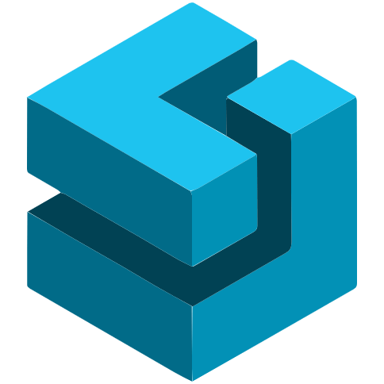

<a name="readme-top"></a>

[![Contributors][contributors-shield]][contributors-url]
[![Forks][forks-shield]][forks-url]
[![Stargazers][stars-shield]][stars-url]
[![MIT License][license-shield]](/LICENSE.txt)


<!-- PROJECT LOGO -->
<br />
<div align="center">
  <a href="/">
    
  </a>

  <h3 align="center">Full-stack Developer Portfolio</h3>

  <p align="center">
    A website to showcase your skills and projects with minimal styles
    <br />
    <a href="#getting-started"><strong>How to setup »</strong></a>
    <br />
    <br />
    <a href="https://codehasan.github.io/">View Demo</a>
    ·
    <a href="https://github.com/codehasan/codehasan.github.io/issues/new?labels=bug">Report Bug</a>
  </p>
</div>


<!-- TABLE OF CONTENTS -->
<details>
  <summary>Table of Contents</summary>
  <ol>
    <li>
      <a href="#about-the-project">About The Project</a>
      <ul>
        <li><a href="#built-with">Built With</a></li>
      </ul>
    </li>
    <li>
      <a href="#getting-started">Getting Started</a>
      <ul>
        <li><a href="#prerequisites">Prerequisites</a></li>
        <li><a href="#installation">Installation</a></li>
        <li><a href="#configuration">Configuration</a></li>
        <li><a href="#deploy">Deploy</a></li>
      </ul>
    </li>
    <li><a href="#contributing">Contributing</a></li>
    <li><a href="#license">License</a></li>
    <li><a href="#contact">Contact</a></li>
    <li><a href="#acknowledgments">Acknowledgments</a></li>
  </ol>
</details>


<!-- ABOUT THE PROJECT -->
## About The Project

[](https://codehasan.github.io)

There are many great portfolio templates available on GitHub, Colorlib and FreeCss. However, I didn't find one that really suited my needs. So, I created this one with minimal fanciness.

Here's why:
* As a backend or backend-heavy full-stack developer, your time should be focused on creating something amazing that will increase and help showcase your skills to recuiters.
* You shouldn't be spending days or weeks designing a portfolio website from scratch.

Of course, no one template may serve all your needs. That's why this project is made using React. So that, you can add your own components according to your needs on your desired places.


### Built With

* 
* 
* 
 * 
* 


<!-- GETTING STARTED -->
## Getting Started

Follow the instructions to setup the project locally, and deploy it on GitHub Pages.

### Prerequisites

Make sure you have either <code>npm</code> or <code>yarn</code> installed and upgraded to the latest version.
* yarn ([Installation Guide](https://www.hostinger.com/tutorials/how-to-install-yarn))
* npm ([Installation Guide](https://kinsta.com/blog/how-to-install-node-js))
  
You also need <code>git</code> to clone this repo locally.
* git ([Installation Guide](https://kinsta.com/knowledgebase/install-git))

### Local Setup

To run and test the project locally in your computer, follow the below steps.

1. Clone the repo
   ```sh
   git clone https://github.com/codehasan/codehasan.github.io.git
   ```
2. Open the cloned directory
   ```sh
   cd codehasan.github.io
   ```
3. Install NPM packages
  - npm
    ```sh
    npm install
    ```
  - yarn
    ```sh
    yarn
    ```
4. Run the website in a browser
   ```sh
   npm run dev
   ```

### Configuration

1. Edit ```homepage``` attribute in ```package.json``` and set it to your domain. If you're deploying in github pages, it will be, ```https://<github-username>.github.io```

### Deploy

* Build the project
   ```sh
   npm run build
   ```

##### Deploy in GitHub Pages

  1. Create a repository with the name, ```<github-username>.github.io```. Here, ```<github-username>``` should be replaced with your actual github username.
  2. Push the local project files in this repository.
  3. Open settings of your repository, navigate to ```Pages``` section. Select the branch where you pushed your files.
  4. Select the root folder to be the folder where npm generated the built project files. By default, it will be ```dist``` folder.

<p align="right"><a href="#readme-top">Back to top</a></p>


<!-- CONTRIBUTING -->
## Contributing

Contributions are what make the open source community such an amazing place to learn, inspire, and create. Any contributions you make are **greatly appreciated**.

If you have a suggestion that would make this better, please fork the repo and create a pull request. You can also simply open an issue with the tag "enhancement".
Don't forget to give the project a star! Thanks again!

1. Fork the Project
2. Create your Feature Branch (`git checkout -b feature/AmazingFeature`)
3. Commit your Changes (`git commit -m 'Add some AmazingFeature'`)
4. Push to the Branch (`git push origin feature/AmazingFeature`)
5. Open a Pull Request


<!-- LICENSE -->
## License

Distributed under the MIT License. See `LICENSE.txt` for more information.

```
The MIT License (MIT)

Copyright (c) 2024 Ratul Hasan

Permission is hereby granted, free of charge, to any person obtaining a copy
of this software and associated documentation files (the "Software"), to deal
in the Software without restriction, including without limitation the rights
to use, copy, modify, merge, publish, distribute, sublicense, and/or sell
copies of the Software, and to permit persons to whom the Software is
furnished to do so, subject to the following conditions:
```

<!-- CONTACT -->
## Contact

* [](https://www.linkedin.com/in/codehasan)
* [](https://t.me/codehasan)
* [](https://twitter.com/code_hasan)
* [](mailto:ratul.hasan.rahat.bd@gmail.com)


<!-- ACKNOWLEDGMENTS -->
## Acknowledgments

I took design ideas from a few repositories listed below by their owner's name.

* [Alejandro Aspinwall](https://github.com/aaspinwall/devPortfolio)
* [Pedro Muniz](https://github.com/salesp07/salesp07.github.io)

<p align="right"><a href="#readme-top">Back to top</a></p>


<!-- LINKS & IMAGES -->
[contributors-shield]: https://img.shields.io/github/contributors/codehasan/codehasan.github.io?style=for-the-badge
[contributors-url]: https://github.com/codehasan/codehasan.github.io/graphs/contributors
[forks-shield]: https://img.shields.io/github/forks/codehasan/codehasan.github.io?style=for-the-badge
[forks-url]: https://github.com/codehasan/codehasan.github.io/network/members
[stars-shield]: https://img.shields.io/github/stars/codehasan/codehasan.github.io?style=for-the-badge
[stars-url]: https://github.com/codehasan/codehasan.github.io/stargazers
[issues-shield]: https://img.shields.io/github/issues/codehasan/codehasan.github.io?style=for-the-badge
[issues-url]: https://github.com/codehasan/codehasan.github.io/issues
[license-shield]: https://img.shields.io/github/license/codehasan/codehasan.github.io?style=for-the-badge